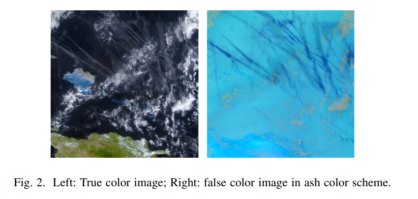

# OpenContrails: Benchmarking Contrail Detection on GOES-16 ABI

- Joe Yue-Hei Ng, Kevin McCloskey, Jian Cui, Vincent R. Meijer, Erica Brand, Aaron Sarna, Nita Goyal,
Christopher Van Arsdale, Scott Geraedts

## Contrails

Contrails, or condensation trails, are cirrus clouds created
by aircraft when flying through cold and humid regions. By
trapping infrared radiation which would have otherwise escaped into space, these contrails warm the earth. Recent works
have suggested that the warming produced by global aviation
through these contrails is comparable to the warming produced
through CO2 emissions. 

- Detecting contrails from satellite images is challenging
because of their visual similarity to natural cirrus. Contrails
are formed as line-shaped ice cloud and then slowly deform
over time, becoming difficult to distinguish from natural cirrus.

## Why it is different from other Computer Vision problems?

While computer vision has made substantial progress thanks to the rise of large scale datasets, like
ImageNet [6], and the use of neural networks, recognition on
domain specific problems like infrared satellite images are still challenging due to the lack of large in-domain datasets for pretraining.

Apart from this in traditional object recognition, textures and colors are informative, but contrails often look similar to or even indistinguishable from natural cirrus.

- There are few differences also, unlike natural cirrus, contrails appear very quickly and spread out rapidly over time.

## Why Human expert's performance is far better from the Deep Learning model?

One possible reason why humans can do better is that during labelling, humans can evaluate the temporal behavior of the contrails, whereas existing computer models perform detection based on only one frame.

## Related Work

Simulations indicate that a small set of flights are responsible for the majority of contrail warming, which suggests that it is possible to adjust a small number of flight routes to substantially reduce global warming.

The nominal pixel size of GOES-16 ABI is 2 × 2km at nadir. This relatively coarse resolution means that contrails cannot be seen when they initially form, instead we must wait some time for them to spread out enough to be visible. This is not necessarily a disadvantage: the warming effects of contrails are dominated by contrails which persist for hours [4], so the inability to detect shorter-lived contrails may not hinder our ability to assess and prevent the vast majority of contrail warming.

## Conditions for Contrail Formation

- Contrails only persist if the humidity of the ice is above a 100%.

Converted the Image from RGB to "ash" false color scheme that combines three longwave GOES-16 brightness
temperatures. This color scheme is chosen to help identify contrails by highlighting ice clouds as darker colors.

## Some Guidelines for Labeling

1) Contrail must contain at least 10 pixels to be labeled;
2) At some time in their life, contrails must be at least 3x
longer than their width;
3) Contrails must either appear suddenly or enter from the
sides of the image;
4) Contrails should be visible in at least two images.

